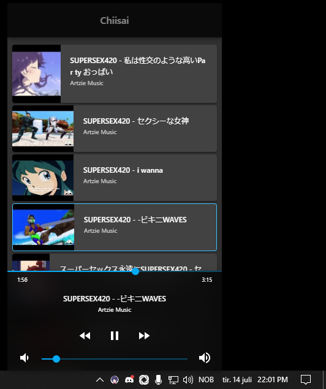

# Chiisai

A tiny music player for the desktop. Uses barely any resources, plays the music you want, and shares it on Discord. It uses YouTube (for now) as media source and uses the OS backend (or in Electrons case, Chromium) for playback.

## Editions

chiisai-apple: Native macOS edition built in Swift; uses YoutubeKit for yt data and SwordRPC for Discord functionality.

chiisai-js: Electron edition of Chiisai built in React TypeScript (using electron-react-boilerplate); uses `simple-youtube-api`for yt data and `discord-rpc` for Discord functionality.
